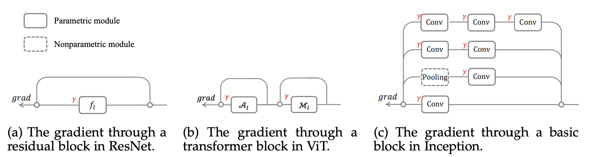
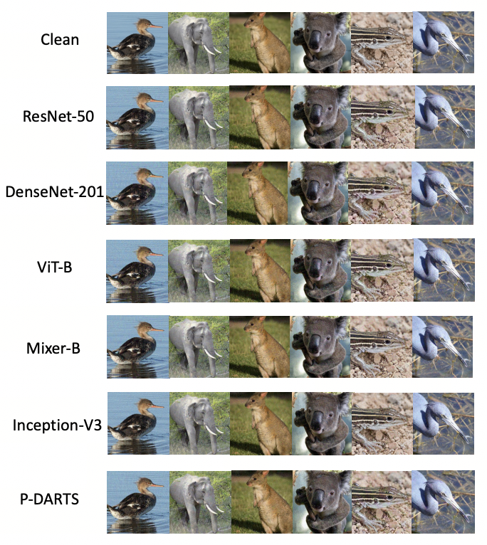

# Generalized Skip Connections Matter

This repository provides the implementation for **"On the Adversarial Transferability of Generalized Skip Connections"** (TPAMI 2026).

## Method

We propose the **Skip Gradient Method (SGM)** to generate adversarial examples by emphasizing gradients from shorter paths over longer paths (generalized skip connections). The figure below illustrates the main idea:



## Requirements

The code is implemented in PyTorch. We have tested it under the following environment:

- Python 3.7.6
- PyTorch 1.7.0
- torchvision 0.8.1
- advertorch 0.2.2
- pretrainedmodels 0.7.4
- timm 0.6.13
- tqdm

## Getting Started

1. **Dataset:** Download from [Google Drive](https://drive.google.com/file/d/1RqDUGs7olVGYqSV_sIlqZRRhB9Mw48vM/view?usp=sharing) or [Baidu Drive](https://pan.baidu.com/s/1AUbdL6W7pHubyftCUgi3wQ) (pw: `55rk`), and extract to `./SubImageNet224/`.

2. **Run experiments:** Use the commands below for each architecture. For each model, we provide scripts to (i) generate adversarial examples with PGD and SGM, and (ii) evaluate transferability with `evaluate_all.py --default`.

### ResNet and DenseNet

Please refer to our open-source code: https://github.com/csdongxian/skip-connections-matter.

### ViT

```bash
pip install timm==0.4.5

# PGD: generate adversarial examples
CUDA_VISIBLE_DEVICES=3 python attack_sgm.py --gamma 1.0 --output_dir adv_images_vit_base_patch16_224_gamma_10 --arch vit_base_patch16_224 --batch-size 50

# SGM: generate adversarial examples
CUDA_VISIBLE_DEVICES=3 python attack_sgm.py --gamma 0.6 --output_dir adv_images_vit_base_patch16_224_gamma_06 --arch vit_base_patch16_224 --batch-size 50

pip install timm==0.6.13

# Evaluate transferability (PGD, Table 11)
CUDA_VISIBLE_DEVICES=3 python evaluate_all.py --default --input_dir adv_images_vit_base_patch16_224_gamma_10

# Evaluate transferability (SGM, Table 11)
CUDA_VISIBLE_DEVICES=3 python evaluate_all.py --default --input_dir adv_images_vit_base_patch16_224_gamma_06
```

### MLP-Mixer

```bash
# PGD: generate adversarial examples
CUDA_VISIBLE_DEVICES=6 python attack_sgm.py --gamma 1.0 --output_dir adv_images_mixer_b16_224_gamma_10 --arch mixer_b16_224 --batch-size 50

# SGM: generate adversarial examples
CUDA_VISIBLE_DEVICES=6 python attack_sgm.py --gamma 0.6 --output_dir adv_images_mixer_b16_224_gamma_06 --arch mixer_b16_224 --batch-size 50

# Evaluate transferability (PGD, Table 12)
CUDA_VISIBLE_DEVICES=6 python evaluate_all.py --default --input_dir adv_images_mixer_b16_224_gamma_10

# Evaluate transferability (SGM, Table 12)
CUDA_VISIBLE_DEVICES=6 python evaluate_all.py --default --input_dir adv_images_mixer_b16_224_gamma_06
```

### Inception

```bash
# PGD: generate adversarial examples
CUDA_VISIBLE_DEVICES=2 python attack_sgm.py --gamma 1.0 --output_dir adv_images_inceptionv3_gamma_10 --arch inceptionv3 --batch-size 50

# SGM: generate adversarial examples
CUDA_VISIBLE_DEVICES=2 python attack_sgm.py --gamma 0.6 --output_dir adv_images_inceptionv3_gamma_06 --arch inceptionv3 --batch-size 50

# Evaluate transferability (PGD, Table 13)
CUDA_VISIBLE_DEVICES=2 python evaluate_all.py --default --input_dir adv_images_inceptionv3_gamma_10

# Evaluate transferability (SGM, Table 13)
CUDA_VISIBLE_DEVICES=2 python evaluate_all.py --default --input_dir adv_images_inceptionv3_gamma_06
```

### P-DARTS

```bash
# PGD: generate adversarial examples
CUDA_VISIBLE_DEVICES=0 python attack_sgm.py --gamma 1.0 --output_dir adv_images_pdarts_gamma_10 --arch pdarts --batch-size 50

# SGM: generate adversarial examples
CUDA_VISIBLE_DEVICES=0 python attack_sgm.py --gamma 0.6 --output_dir adv_images_pdarts_gamma_06 --arch pdarts --batch-size 50

# Evaluate transferability (PGD, Table 14)
CUDA_VISIBLE_DEVICES=0 python evaluate_all.py --default --input_dir adv_images_pdarts_gamma_10

# Evaluate transferability (SGM, Table 14)
CUDA_VISIBLE_DEVICES=0 python evaluate_all.py --default --input_dir adv_images_pdarts_gamma_06
```

## Visualization



## Pretrained Models

We use the following sources for pretrained weights:

- **VGG / ResNet / DenseNet / SENet / Inception-V3 / Inception-V4 / Inception-ResNetV2:** [pretrainedmodels](https://github.com/Cadene/pretrained-models.pytorch)
- **ViT / PiT / ConViT / TNT / Visformer / MLP-Mixer:** [timm](https://github.com/huggingface/pytorch-image-models)
- **P-DARTS:** [pdarts](https://github.com/chenxin061/pdarts)
## Citation

If you find this work useful, please cite:

```bibtex
@article{wang2026adversarial,
  title={On the Adversarial Transferability of Generalized “Skip Connections”},
  author={Wang, Yisen and Mo, Yichuan and Wu, Dongxian and Li, Mingjie and Ma, Xingjun and Lin, Zhouchen},
  journal={IEEE Transactions on Pattern Analysis and Machine Intelligence},
  year={2026},
  publisher={IEEE}
}
```
